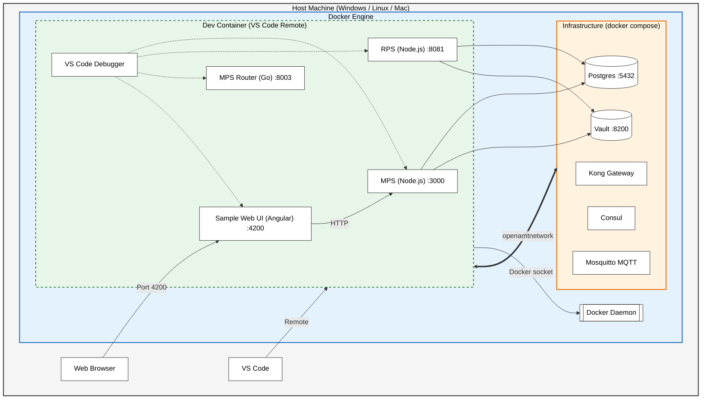
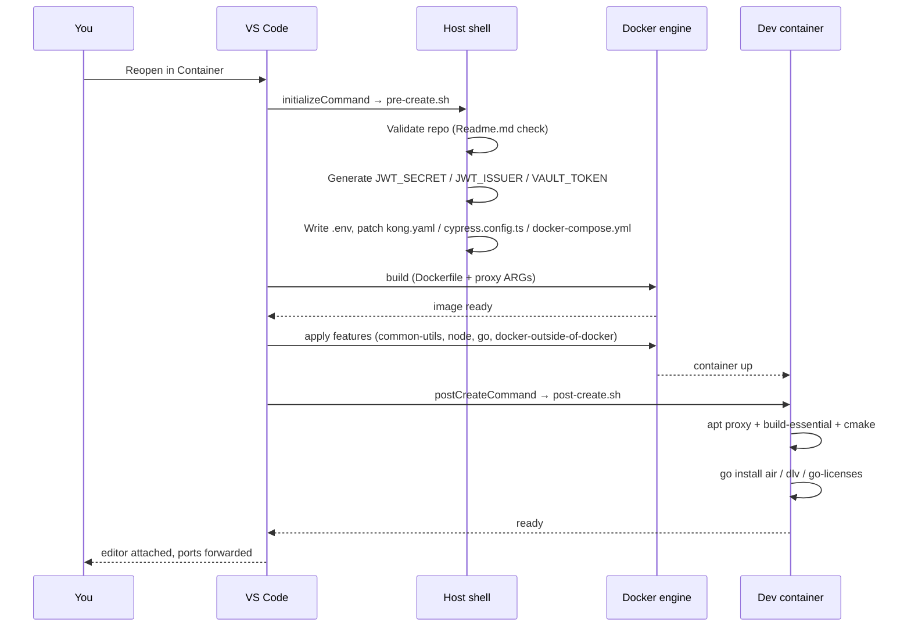

# Cloud Deployment — Developer Guide (Dev Container)

This guide is written from a **developer's perspective**: clone the repo, open it in VS Code, and start debugging the Open AMT Cloud Toolkit services without manual setup.

---

## 1. What you get out of the box

When you open this repo in VS Code and click **Reopen in Container**, the environment auto-provisions:

- An **Ubuntu 22.04** dev container with corporate proxy passthrough
- Node.js, Go, Docker (outside-of-docker), zsh + oh-my-zsh
- Go tooling: `air`, `dlv`, `go-licenses`
- VS Code extensions: Docker, ESLint, Go, C/C++, Prettier, GitBlame, Markdown Preview Enhanced, etc.
- Auto-generated `.env` with **unique per-developer** JWT secrets / Vault token
- Pre-patched `kong.yaml`, `cypress.config.ts`, `docker-compose.yml`
- Pre-configured debug profiles (`F5` → debug all services)
- Forwarded ports: **4200** (WebUI), **3000** (MPS), **8081** (RPS), **8003** (Router)

---

## 2. Architecture — what runs where

The environment is **hybrid**:

- **Your code** (MPS, RPS, Router, WebUI) runs *inside* the Dev Container as normal processes — full IntelliSense and breakpoint debugging.
- **Infrastructure** (Postgres, Vault, Kong, Consul, Mosquitto) runs as Docker containers on the host engine, reached via Docker-outside-of-Docker.



---

## 3. Quick start

### Prerequisites

- Docker Desktop (Win/Mac) or Docker Engine (Linux)
- VS Code with the **Dev Containers** extension

### Steps

1. Clone the repo (recursive — it uses submodules):

   ```bash
   git clone --recursive https://github.com/device-management-toolkit/cloud-deployment.git
   cd cloud-deployment
   ```

2. Open the folder in VS Code → click **Reopen in Container** (or `Ctrl+Shift+P` → *Dev Containers: Reopen in Container*).
3. First launch takes a few minutes — VS Code builds the image, generates your `.env`, and installs Go tools. You're done when the terminal returns a zsh prompt.

### Behind the scenes — what the lifecycle hooks do



> **Note:** Secrets are generated only on first launch. If `.env` already has `MPS_JWT_SECRET`, `pre-create.sh` leaves it alone — safe to re-open the container any time.

---

## 4. Daily workflow

### 4.1 Start infrastructure

`Ctrl+Shift+P` → **Tasks: Run Task** → **Start Infrastructure**
Brings up Postgres, Vault, Kong, Consul, Mosquitto via `docker compose`.

### 4.2 Connect the container to the infra network

**Tasks: Run Task** → **Connect DevContainer to Network**
Required so MPS/RPS can resolve `db`, `vault`, etc.

### 4.3 (Optional) Serve the Web UI

**Tasks: Run Task** → **Serve WebUI (Angular)** — wait for Angular to finish compiling.

### 4.4 Debug services

- Open **Run and Debug** (`Ctrl+Shift+D`)
- Select **Debug All Services**
- Press **F5** — MPS, RPS, and the Router launch under the debugger; if the WebUI task is running, a Chrome window attaches to the frontend.

---

## 5. File map

| File | Role |
|---|---|
| `.devcontainer/devcontainer.json` | Container definition, features, port forwarding, extension list |
| `.devcontainer/Dockerfile` | Ubuntu 22.04 + proxy env + sudoers `env_keep` |
| `.devcontainer/devcontainer-lock.json` | Pinned feature digests for reproducible builds |
| `.devcontainer/pre-create.sh` | **Host** hook: validates repo, generates secrets, writes `.env`, patches `kong.yaml` / `cypress.config.ts` / `docker-compose.yml` |
| `.devcontainer/post-create.sh` | **Container** hook: apt proxy, `build-essential`, `cmake`, Go tools |
| `.vscode/launch.json` | Debug configs for Node (MPS/RPS), Go (Router), Chrome (WebUI) |
| `.vscode/tasks.json` | Helper tasks: start infra, connect network, serve WebUI, etc. |

---

## 6. Proxy support

If you're behind a corporate proxy, export `HTTP_PROXY` / `HTTPS_PROXY` / `NO_PROXY` on the host **before** opening the container. They flow through automatically:

```
host env → devcontainer.json build args / containerEnv
         → Dockerfile ENV
         → sudoers env_keep
         → /etc/apt/apt.conf.d/99proxy
```

---

## 7. Troubleshooting

| Symptom | Fix |
|---|---|
| `database connection failed` | Run **Start Infrastructure** *and* **Connect DevContainer to Network**. Services resolve Postgres by host `db`. |
| Web UI not accessible at `localhost:4200` | Check the **Ports** view (`Ctrl+J` → Ports). Port 4200 should map to localhost. |
| `apt-get update` fails inside the container | Confirm your proxy env vars are set on the host before reopening; check `/etc/apt/apt.conf.d/99proxy` exists. |
| Go tools (`air`, `dlv`) missing | Re-run `post-create.sh` manually: `bash .devcontainer/post-create.sh`. |
| Want fresh secrets | Delete `.env` and reopen the container — `pre-create.sh` regenerates it. |
